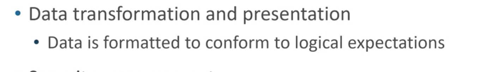

# Initial page

## Getting Super Powers

Becoming a super hero is a fairly straight forward process:

hello **world**

1. hello
   * world
     * world

A sprint in Agile represents which of the following

123

123

123123

| JOB TITLE | DESCRIPTION | SAMPLE SKILLS REQUIRED |
| :--- | :--- | :--- |
| Database Developer | Create and maintain database-based applications | Programming, database fundamentals, SQL |






























```

```















>



| 1 | 1 | 1 | 1 |
| :--- | :--- | :--- | :--- |
| 1 | 1 | 1 | 1 |







```
$ give me super-powers
```


 Super-powers are granted randomly so please submit an issue if you're not happy with yours.


Once you're strong enough, save the world:


```bash
# Ain't no code for that yet, sorry
echo 'You got to trust me on this, I saved the world'
```



