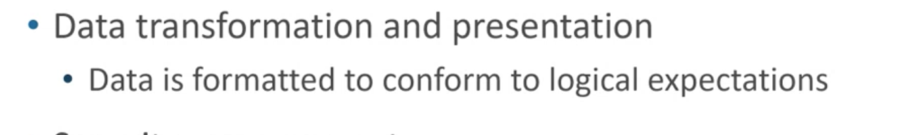

# Untitled

## Getting Super Powers

Becoming a super hero is a fairly straight forward process:

1. A sprint in Agile represents which of the following?
   * A sprint in Agile represents which of the following
   * A sprint in Agile represents which of the following
   * A sprint in Agile represents which of the following
2. A sprint in Agile represents which of the following
   1. A sprint in Agile represents which of the following
   2. A sprint in Agile represents which of the following
   3. A sprint in Agile represents which of the following


### Video





1. 123
   *  
   * 123



{% embed url="https://firebasestorage.googleapis.com/v0/b/gitbook-28427.appspot.com/o/assets%2F-MZuaqE0-Gff9f6uk2Q4%2F-MZujpI0fuRHLH7Kwu1q%2F-MZuk-9gJ-tPIXSVes7p%2FCar%20Rental%20System%20Domain%20Modeling%20Example.pdf?alt=media&token=1877a169-fa84-4833-b32a-5e90fdcdeb6e" %}





{% embed url="https://firebasestorage.googleapis.com/v0/b/gitbook-28427.appspot.com/o/assets%2F-MZuaqE0-Gff9f6uk2Q4%2F-MZueLyP52kk5w0kLGj8%2F-MZuf96T1d0Ud02HHtaf%2FCh02.ppt?alt=media&token=2533f8cd-0a34-487a-ba2d-86ac895f3dc5" %}


```
$ give me super-powers
```


 Super-powers are granted randomly so please submit an issue if you're not happy with yours.


Once you're strong enough, save the world:


```bash
# Ain't no code for that yet, sorry
echo 'You got to trust me on this, I saved the world'
```



